# GroupifyVAE: from Group-based  Definition to VAE-based Unsupervised Representation Disentanglement

> **GroupifyVAE: from Group-based  Definition to VAE-based Unsupervised Representation Disentanglement** <br>
> Tao Yang, Xuanchi Ren, Yuwang Wang, Wenjun Zeng, Nanning Zheng and Pengju Ren <br>
> *arXiv preprint arXiv:2007.06600*<br>
> 
[[Paper]()]
[[Appendix](./GroupifyNet_ICML_2021_appendix.pdf)]
[[Demo]()]

In this repo, we propose a specific form of the **group-based definition** and prove its two equivalent conditions: **isomorphism** and ``the constancy of permutations''. And the inceptaul framework is as follows

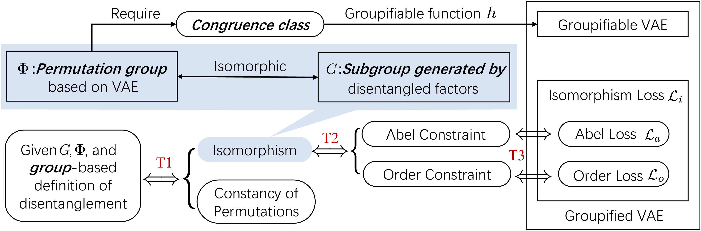

We further provide an implementation of **isomorphism** based on two Group constraints: the Abel constraint for the exchangeability and Order constraint for the cyclicity. We then convert them into a **self-supervised training loss** that can be incorporated into VAE-based models to **bridge their gaps** from the Group Theory based definition. The overview of our method is as follows:

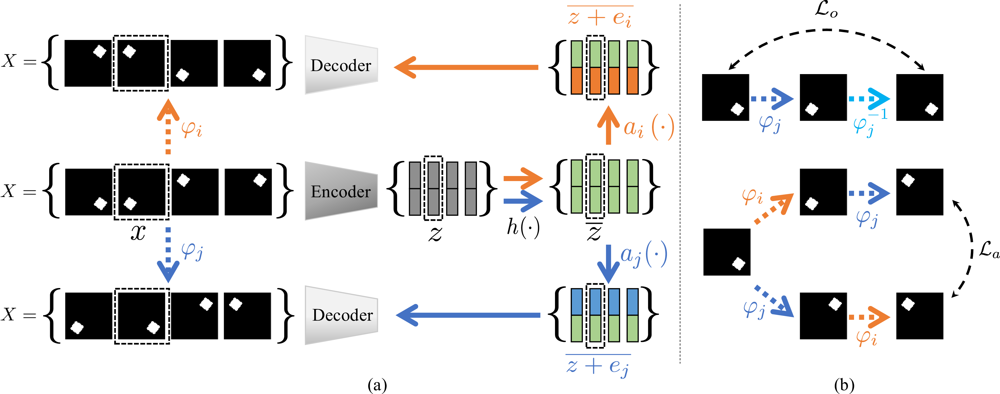


## Qualitative evaluation
| dSprites | |
| :---: | :---: |
| BetaVAE | DCI |
| 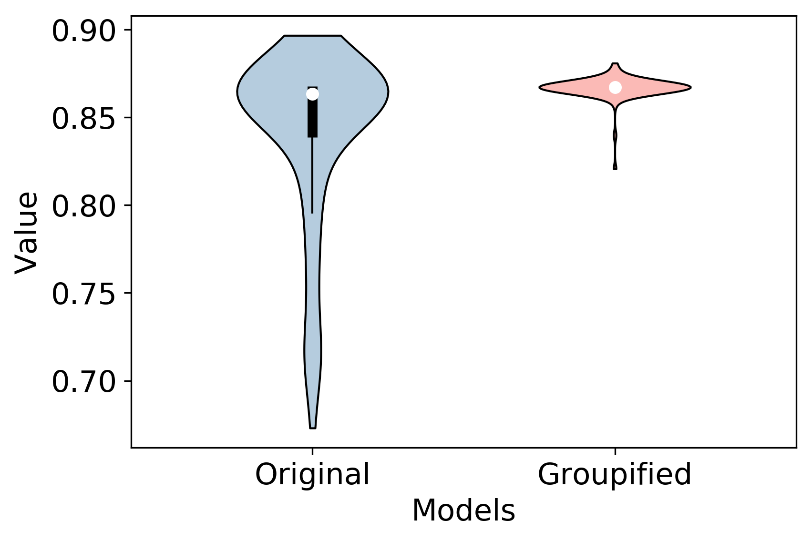 | 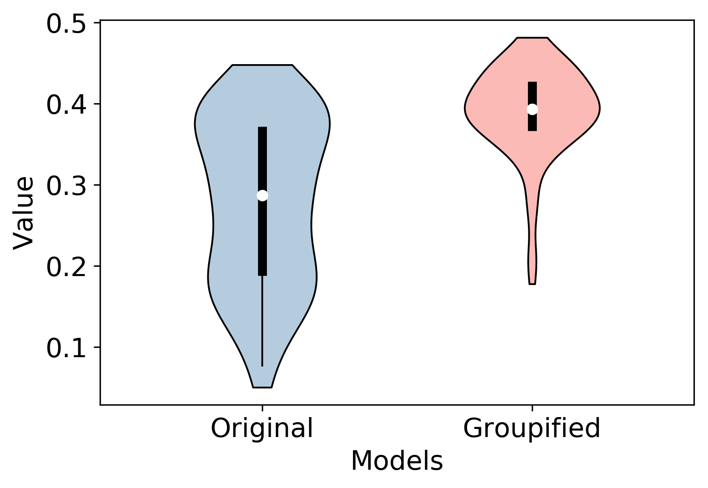 |
| MIG | FactorVAE |
| 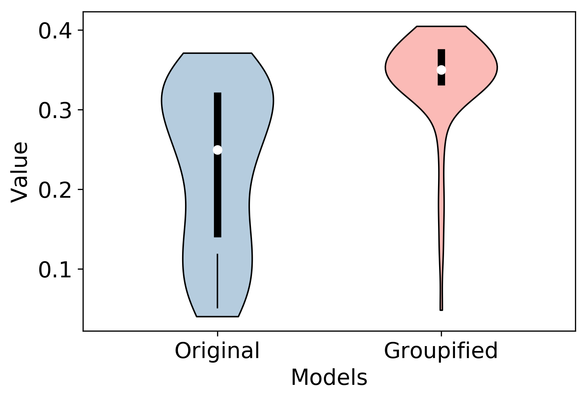 | 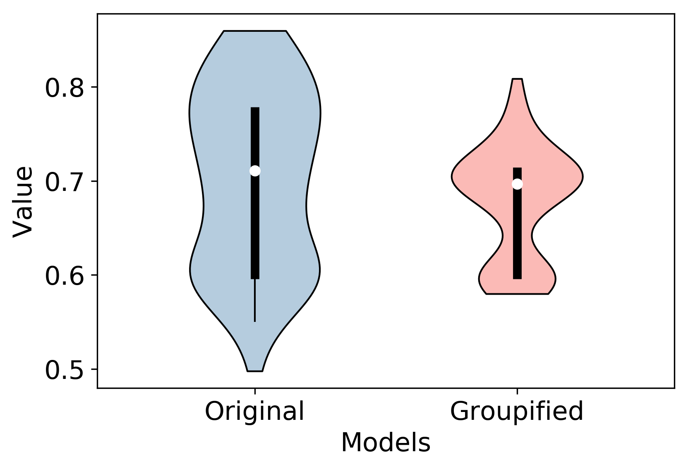 |

**NOTE:** Groupified VAE achieves better performance mean with lower variance.

## Latent space visualization
| dSprites AnnealVAE |  |
| :---: | :---: |
| $C_{max} = 10$, Original | $C_max = 20$, Original|
| 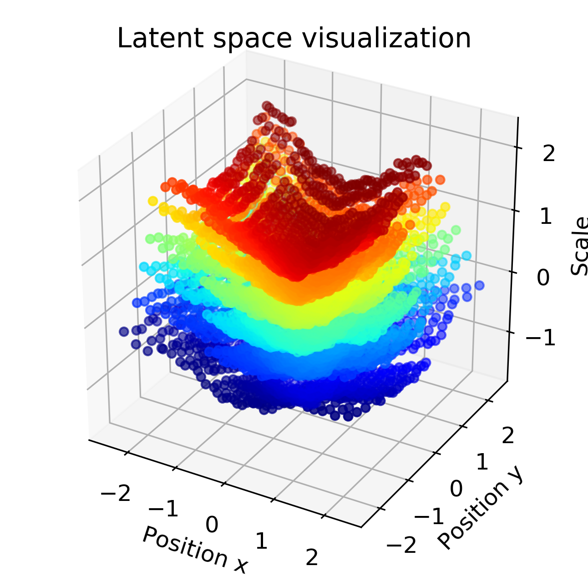 | 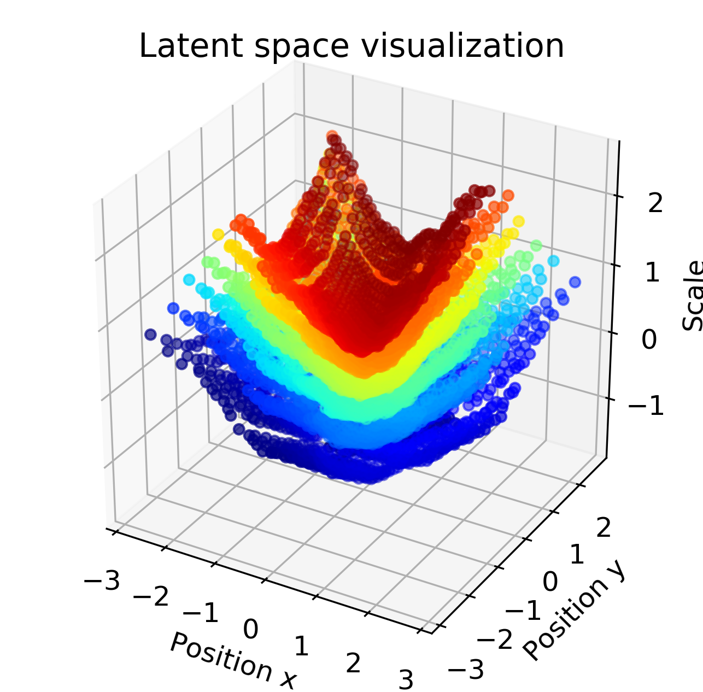 |
| $C_{max} = 10$, Groupified | $C_{max} = 20$, Groupified |
| 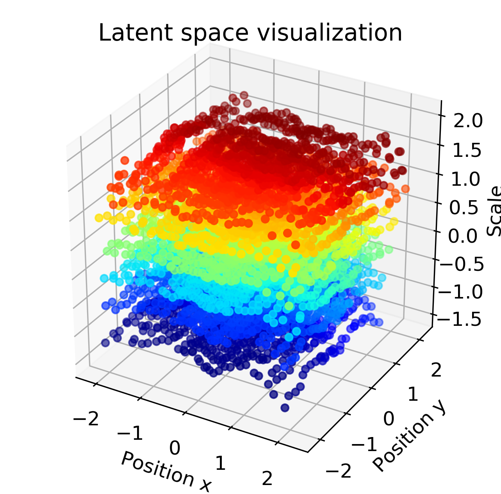 | 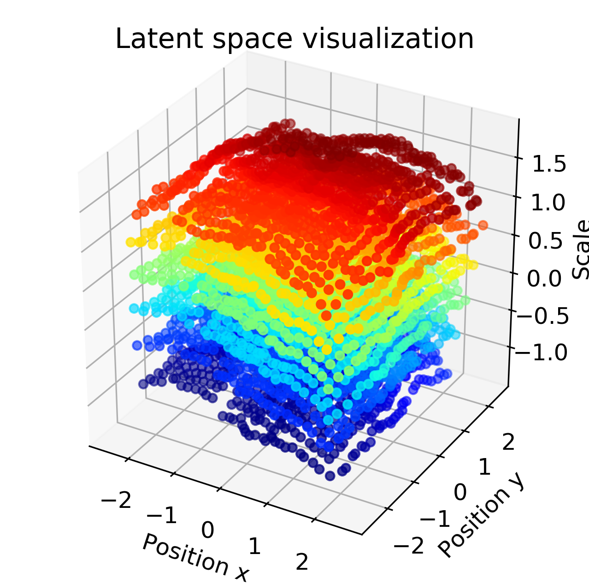 |

## Qualitative results
|Cars3d and Shapes3d | |
| :---: | :---: |
| Original | Groupified|
| 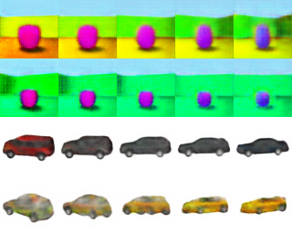 | 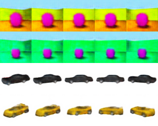 |


## Controllable meaningful dimensions in Groupified VAEs
| dSprites Anneal VAE | |
| :---: | :---: |
| KL divergence of dimensions | Traversal results |
| 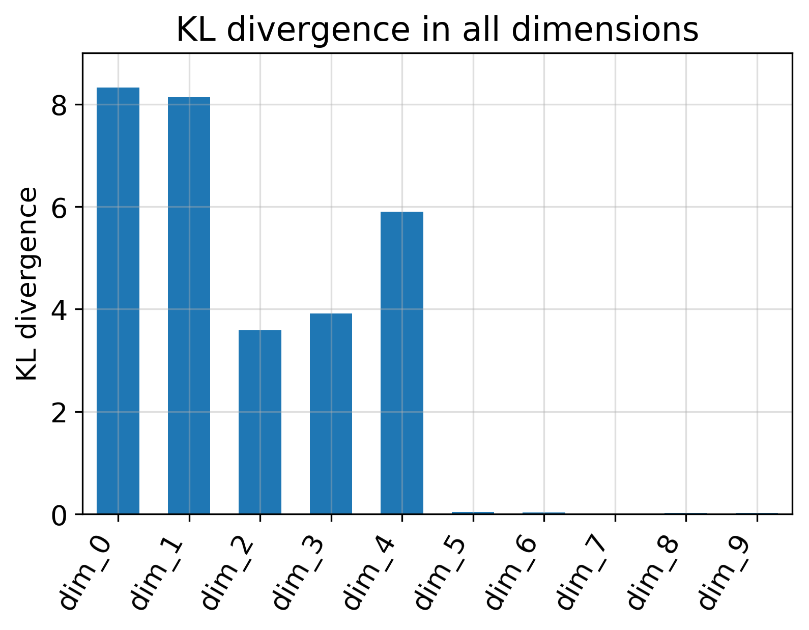 |  |

## Downstream Task Performance
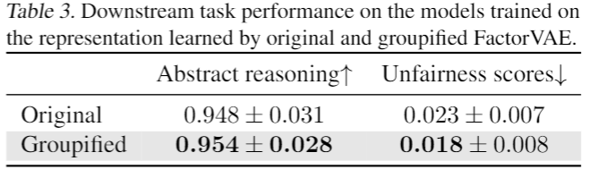


## BibTeX

```bibtex
@article{Tao2021groupified,
  title   = {GroupifyVAE: from Group-based  Definition to VAE-based Unsupervised Representation Disentanglement},
  author  = {Tao, Yang and Xuanchi, Ren and Yuwang, Wang and Wenjun, Zeng and Nanning, Zheng and Pengju,Ren},
  journal = {arXiv preprint arXiv:2007.06600},
  year    = {2021}
}
```
